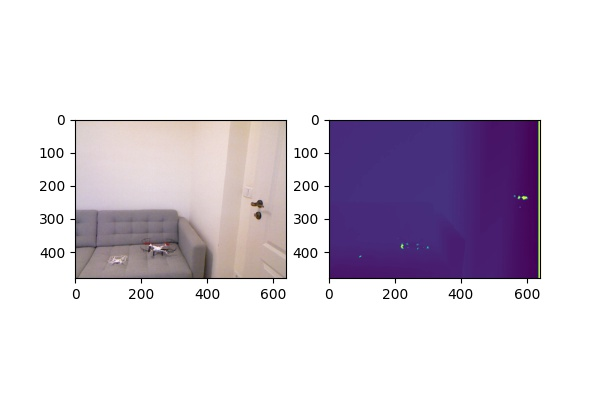
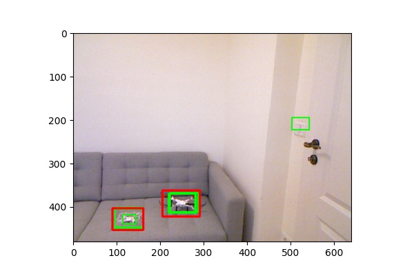
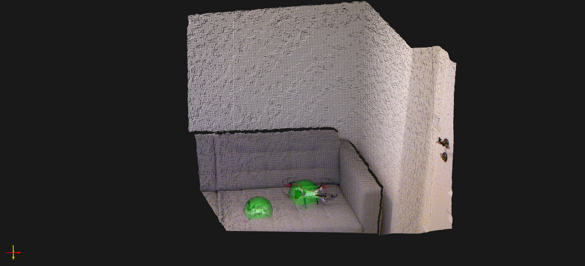

# Object classification from 2D images to 3D point cloud

This approach uses the available methods for image object classification in 2D then projects the results based on RGB-D depth information to the 3D space.
Object classification (in this case) is made with Cascade classifier, but easily can be changed with a Deep Neuronal Network.

Processig steps:
1. RGB and Depth information is loaded

 
  </a>

2. RGB image is applied to a Cascade classifier. Results are filtered with Non-Maximum-Suppression

 
  </a>

3. Object coordinated are projected in 3D space using Kinect claibration parameters. Detection are plotted on the 3D Point Cloud

 
  </a>

Note: for visualization purposes, the pyvista and itk viewer is used. Please follow the installation instructions: https://github.com/InsightSoftwareConsortium/itkwidgets

More details on the implementation, algorithms can be found here:

 - https://github.com/fvilmos/kinect_point_cloud - visualization of Kinect 3d data
 - https://github.com/fvilmos/cascade_tools - train your cascade
 - https://github.com/fvilmos/cascade_nms - false positive filtering with Non-Maximum-Suppression

### TODO
 - Optimize Classifier - change with i.e. Yolo or Mobilenet
 - with a good classifier optimize away the Non-Maximum-Suppression step

Any contribution is welcomed!

# Resources

1. [Cascade_tools](https://github.com/fvilmos/cascade_tools)
2. [Non-Maximum-Suppression - cascade](https://github.com/fvilmos/cascade_nms)

/Enjoy.
